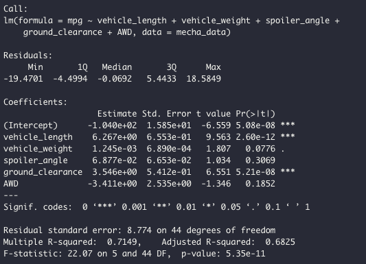
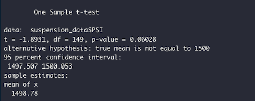
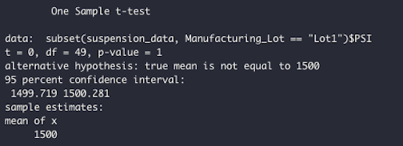
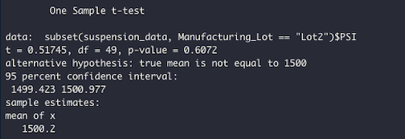
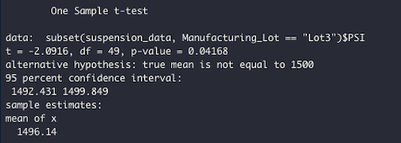

# **MechaCar Statistical Analysis**

## **Linear Regression to Predict MPG**

Statistical Summary of the Linear Regression Model:

1. Which variables/coefficients provided a non-random amount of variance to the mpg values in the dataset?

    - Vehicle_length and ground_clearance have p-values much smaller than the assumed significance level of 0.05 therefore, we reject the null hypothesis. These two variables provided non-random amount of variance to the mpg values in the dataset.  
    - Vehicle_weight seems to provide some slight amount of variance but this is not statistically significant as the p-value is higher than the assumed significance level.

2. Is the slope of the linear model considered to be zero? Why or why not?

    - The slope of the linear model is not considered zero as we reject the null hypothesis as the p-value of 5.35e-11 is smaller than the significance level of 0.05.

3. Does this linear model predict mpg of MechaCar prototypes effectively? Why or why not?

    - This linear model does predict the mpg of MechaCar prototypes decently as the r-squared value is 0.7149. This means that 71% of the time this model correctly predicts the mpg of MechaCar prototypes  

## **Summary Statistics on Suspension Coils**

The design specifications for the MechaCar suspension coils dictate that the variance of the suspension coils must not exceed 100 pounds per square inch. 

1. Does the current manufacturing data meet this design specification for all manufacturing lots in total? Why or why not?

    Total Summary:
    

    - The manufacturing data meets the design specification for all manufacturing lots in total as the variance is at 62.29, which is below 100 PSI specification.

2. Does the current manufacturing data meet this design specification for each lot individually? Why or why not?

    Manufacturing Lot Summary:
    

    - Across individual lots, Lot 1 and Lot 2 are both within the variance dictated in the design specifications.  Additionally they have the same mean and median.
    - Lot 3 has a variance that exceeds 100 PSI at 170.29 so Lot 3 does not meet the design specifications. 

## **T-Tests on Suspension Coils**

1. Is the PSI across all manufacturing lots statistically different from the population mean of 1,500 pounds per square inch?
    
    Total Summary:
    

    - Total lots PSI values are not statistically different from the population mean of 1,500 as the p-values are higher than the significance level at 0.06.

2. Is the PSI for each manufacturing lots statistically different from the population mean of 1,500 pounds per square inch?

    Lot 1 Summary:
    

    Lot 2 Summary:
    

    Lot 3 Summary:
    

    - Lot 1 and Lot 2 PSI values are not statistically different from the population mean of 1,500 PSI as the p-values are higher than the significance level and has the same mean at 1,500.
    - Lot 3 has a p-value that is smaller than the significance level at 0.04168 so there is evidence that the mean PSI is statistically different from the population mean.

## **Study Design: MechaCar vs Competition**

Quantify how the MechaCar performs against the competition.

1. What metric or metrics are you going to test?

    - There are a lot of metrics a consumer may be interested in to see how MechaCar performs against the competition such as cost, city or highway fuel efficiency, horse power, maintenance cost or safety rating.  
    - We should look to test horse power as this is a common metric that consumers look for when evaluating performance of vehicles.  We can gather sufficient data due to this being such a common peformance metric.

2. What is the null hypothesis or alternative hypothesis?

    - The null hypothesis would be that there is no statistical difference between MechaCar horse power and horse power of its competitors.

3. What statistical test would you use to test the hypothesis? And why?

    - We would use a t-test, specifically a one-sample t-test.
    - We would use a one-sample t-test because we need to determine whether or not there is a statistical difference between the mean of data points from MechaCar vehicles (sample dataset) and the mean from the competition (population dataset).

4. What data is needed to run the statistical test?

    - We will need data points for horse power from the competitor vehicles and data points for horse power from MechaCar vehicles.  